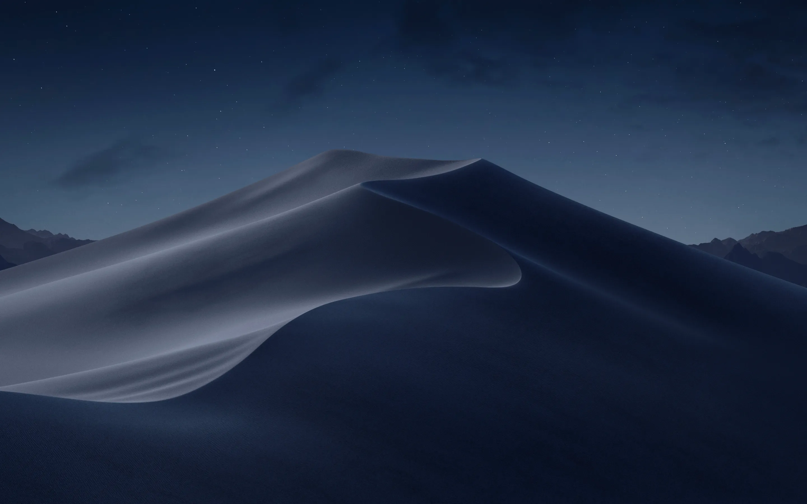

<div align="center">

# 🍎 Omi's Portfolio

### *A macOS desktop experience, in the browser.*

[](https://react.dev)
[](https://vitejs.dev)
[](https://tailwindcss.com)
[](https://www.typescriptlang.org)
[](https://gsap.com)

<br/>

> *I wanted to make a portfolio. Then I decided to make an entire operating system instead.*

<br/>



</div>

---

## 🖥️ What Is This?

It's a portfolio. But also a fake macOS desktop. You can open windows, drag them around, minimize them into the dock, switch wallpapers, toggle dark mode from a control center panel, and even boot it up with a startup screen.

Did it need to be this extra? No. Did it end up this way anyway? Absolutely.

---

## ✨ The Things That Exist Here

| App | What it does |
|-----|--------------|
| 🗂️ **Finder / Portfolio** | Browse projects like files and folders |
| 🌐 **Safari / Articles** | A start page with favorites and a reading list |
| 🖼️ **Photos / Gallery** | Image gallery with category sidebar + wallpaper picker |
| 💬 **Contact** | Links and socials to reach out |
| 💻 **Terminal / Skills** | Tech stack shown as a retro terminal readout |
| 📄 **Resume** | Live PDF viewer with download button |
| 📝 **Text Viewer** | Project detail files, like `.txt` files but make it cute |
| 🎬 **Video Player** | Demo videos embedded in a QuickTime-style window |
| 📖 **Script Reader** | Multi-episode PDF viewer for the Meatlovers web series |

---

## 🌟 Little Details Worth Noticing

- **Boot screen** with a progress bar before the desktop even loads
- **Dock icons** that scale on hover with a satisfying magnetic effect
- **Welcome text** where letters change weight as your mouse moves across them
- **macOS-style Control Center** with working brightness/volume sliders, Wi-Fi, Bluetooth, dark mode toggle, and a fake now-playing widget
- **Minimize animations** that shrink windows into the dock icon they came from
- **Wallpaper persists** across sessions via localStorage (pick one from the Gallery)
- **Mobile layout** that collapses into an iOS-style UI with a Dynamic Island status bar
- **Dark mode** that's actually designed for dark mode, not just inverted colors

---

## 🛠️ The Stack

```
Frontend    →  React 19 + TypeScript
Styling     →  Tailwind CSS v4 + custom CSS
Animations  →  GSAP + Draggable
State       →  Zustand + Immer
PDF         →  react-pdf (pdfjs-dist)
Themes      →  next-themes
Build       →  Vite 8
```

---

## 🚀 Running It Locally

```bash
# Clone
git clone https://github.com/dharmaayomi/macos-porto.git
cd macos-porto

# Install
npm install

# Run
npm run dev
```

Then open `http://localhost:5173` and enjoy the boot screen.

---

## 📁 Project Layout

```
src/
├── components/     # Navbar, Dock, Welcome, Boot screen, Window controls
├── windows/        # Each "app" is its own component
├── constants/      # All the content data (projects, gallery, terminal stack)
├── store/          # Zustand stores for windows, location, wallpaper
├── hooks/          # useWindow (animation + drag), useDevice, useBootAssetPreloader
└── index.css       # All the styling, including dark mode + boot screen
```

---

## 📬 Get In Touch

- 📧 officialomicumi@gmail.com
- 🐙 [github.com/dharmaayomi](https://github.com/dharmaayomi)
- 💼 [linkedin.com/in/dharma-ayomi-ramadhani](https://www.linkedin.com/in/dharma-ayomi-ramadhani/)
- 🌐 [portofoliomi.vercel.app](https://portofoliomi.vercel.app/)

---

<div align="center">

Made with too much free time and a deep love for unnecessary UI details. 🍎

</div>